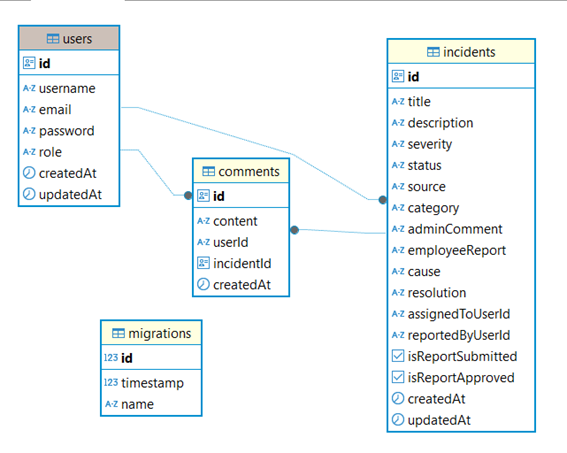
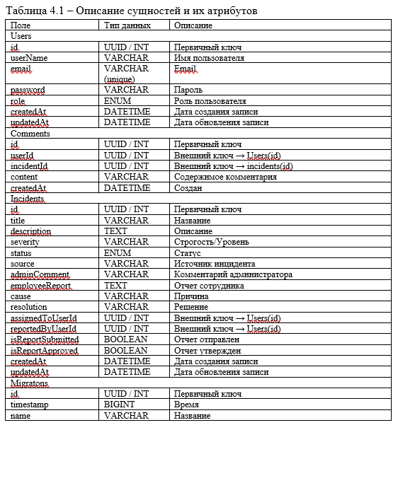
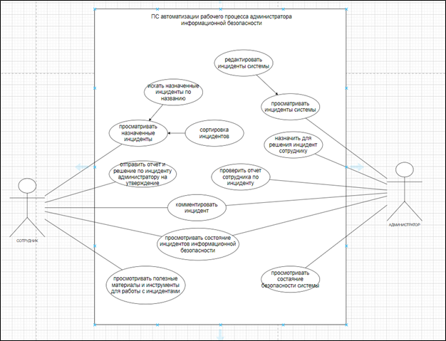
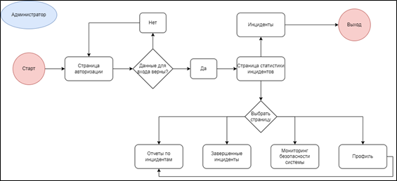
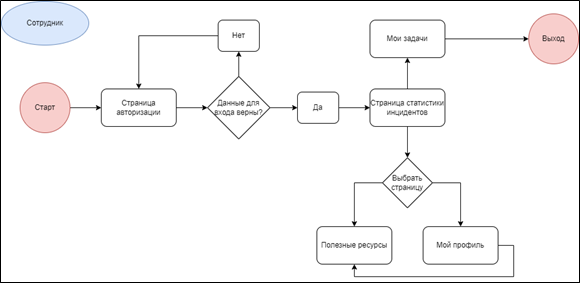
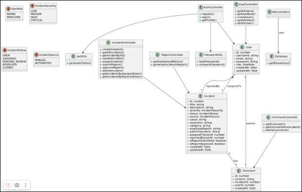
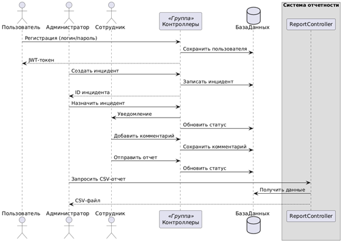
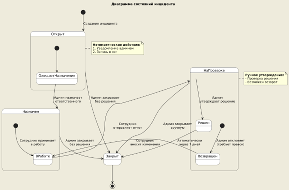
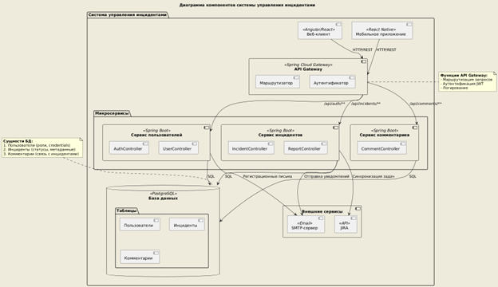
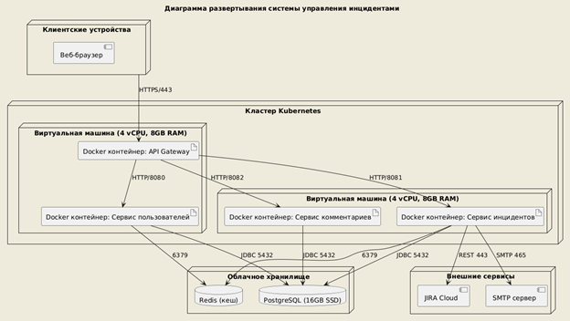

# **Название проекта**

Программного средство автоматизации рабочего процесса 
администратора информационной безопасности.
ПС предназначено для быстрого реагирования и анализа на инциденты ИБ системы.
В ПС иммется возможность авторизации и регистрации пользователей, работа с инцидентами
(просмотр, редактирование, комментирование, подготовка и утверждение отчета по инциденту).

Ссылки на репозитории сервера и клиента
https://github.com/eelvov/LvovEE_214371_RIOPK_Server
https://github.com/eelvov/LvovEE_214371_RIOPK_Client 

---

## **Содержание**

1. [Архитектура](#Архитектура)
	1. [C4-модель](#C4-модель)
	2. [Схема данных](#Схема_данных)
2. [Функциональные возможности](#Функциональные_возможности)
	1. [Диаграмма вариантов использования(#Диаграмма_вариантов_использования)]
	2. [User-flow диаграммы](#User-flow_диаграммы)
3. [Детали реализации](#Детали_реализации)
	1. [UML-диаграммы](#UML-диаграммы)
	2. [Спецификация API](#Спецификация_API)
	3. [Безопасность](#Безопасность)
	4. [Оценка качества кода](#Оценка_качества_кода)
4. [Тестирование](#Тестирование)
	1. [Unit-тесты](#Unit-тесты)
	2. [Интеграционные тесты](#Интеграционные_тесты)
5. [Установка и  запуск](#installation)
	1. [Манифесты для сборки docker образов](#Манифесты_для_сборки_docker_образов)
	2. [Манифесты для развертывания k8s кластера](#Манифесты_для_развертывания_k8s_кластера)
6. [Лицензия](#Лицензия)
7. [Контакты](#Контакты)

---
## **Архитектура**

### C4-модель

(image.png)

ПС состоит из клиентской части (технологии React + TS + Vite), серверной части (Node.js + TypeScript), базы данных (PostgreSQL 17).
В клиентской части реализован графический интерфейс и API-обработчки, который посылает API-запросы на серверную часть ПС для дальнейшей их обработки и взайимодейтсвия с базами данных.

### Схема данных

Скрипт (программный код), который необходим для генерации БД

import { Client } from 'pg';
import dotenv from 'dotenv';
import path from 'path';
import fs from 'fs';

 
dotenv.config({ path: path.join(__dirname, '../../.env') });

const dbName = process.env.DB_NAME || 'security_admin_business';
const dbUser = process.env.DB_USERNAME || 'postgres';
const dbPassword = process.env.DB_PASSWORD || 'postgres';
const dbHost = process.env.DB_HOST || 'localhost';
const dbPort = Number(process.env.DB_PORT) || 5432;

async function createDatabaseIfNotExists() {
   
  const client = new Client({
    user: dbUser,
    password: dbPassword,
    host: dbHost,
    port: dbPort,
    database: 'postgres' 
  });

  try {
    await client.connect();
    console.log('Connected to PostgreSQL server');

     
    const res = await client.query(`
      SELECT 1 FROM pg_database WHERE datname = $1
    `, [dbName]);

     
    if (res.rows.length === 0) {
      console.log(`Database ${dbName} does not exist. Creating...`);
      await client.query(`CREATE DATABASE ${dbName}`);
      console.log(`Database ${dbName} created successfully!`);
    } else {
      console.log(`Database ${dbName} already exists.`);
    }

    
    console.log('Connecting to the newly created database to setup enum types...');
    await client.end();

    const appDbClient = new Client({
      user: dbUser,
      password: dbPassword,
      host: dbHost,
      port: dbPort,
      database: dbName
    });

    await appDbClient.connect();

  
    await appDbClient.query(`
      DO $$
      BEGIN
        IF NOT EXISTS (SELECT 1 FROM pg_type WHERE typname = 'incident_severity_enum') THEN
          CREATE TYPE incident_severity_enum AS ENUM ('low', 'medium', 'high', 'critical');
        END IF;
        
        IF NOT EXISTS (SELECT 1 FROM pg_type WHERE typname = 'incident_status_enum') THEN
          CREATE TYPE incident_status_enum AS ENUM ('open', 'assigned', 'in_progress', 'pending_review', 'resolved', 'closed', 'завершено');
        END IF;
        
        IF NOT EXISTS (SELECT 1 FROM pg_type WHERE typname = 'incident_source_enum') THEN
          CREATE TYPE incident_source_enum AS ENUM ('system', 'manual');
        END IF;
      END$$;
    `);

    console.log('Enum types created or already exist.');
    await appDbClient.end();

    console.log('Database setup completed successfully!');
  } catch (err) {
    console.error('Error setting up database:', err);
  } finally {
    
    if (client.connected) {
      await client.end();
    }
  }
}

// Запускаем функцию создания базы данных
createDatabaseIfNotExists(); 
---

## **Функциональные возможности**

### Диаграмма вариантов использования

Диаграмма вариантов использования и ее описание 

Сотруднику доступен следующий функционал:
 просмотр назначенных инцидентов;
 поиск инцидентов по названию;
 сортировка инцидентов;
 отправка отчета и решения по инциденту администратору;
 комментирование инцидента;
 просмотр состояния инцидентов информационной безопасности;
 просмотр полезных материалов и инструментов для работы с инцидентами.
Администратор обладает расширенным функционалом:
 просмотр инцидентов системы;
 редактирование инцидентов системы;
 назначение инцидента сотруднику;
 комментирование инцидента;
 проверить отчет сотрудника по инциденту;
 просмотр мониторинг безопасности системы;
 просмотр состояния инцидентов информационной безопасности.

### User-flow диаграммы

Описание переходов между части ПС для всех ролей из диаграммы ВИ (название ролей должны совпадать с тем, что указано на c4-модели и диаграмме вариантов использования)

При запуске ПС, пользователь попадает на стартовую страницу авторизации, где ему необходимо ввести данные (логин, пароль) профиля. В случае вверно введенных данных пользователь доступен функционал, в соответсвии со своей ролью "Сотрудник" или "Администратор". 
--

## **Детали реализации**

### UML-диаграммы

Представить все UML-диаграммы , которые позволят более точно понять структуру и детали реализации ПС

Диаграмма классов – отражает основные сущности системы: сущности БД User + UserRole, Incident + IncidentStatus/Severity/Source, Comment, контроллеры, AuthController (регистрация/авторизация),UserController (CRUD пользователей),IncidentController (управление инцидентами), CommentController (комментарии),ReportController (аналитика и отчеты), их свойства и взаимосвязи. Представлена структура данных и логика взаимодействия между объектами.
Диаграмма последовательности – описывает порядок взаимодействия объектов при выполнении ключевых операций.
Диаграмма состояний – отображает жизненный цикл инцидента: от рассмотрения до закрытия.
Диаграмма компонентов – показывает, как клиентская часть (frontend), сервер (backend), БД, система авторизации между собой.
Диаграмма развертывания – демонстрирует развертывание компонентов системы в реальной среде: браузер пользователя, веб-сервер, база данных, сторонние API.

### Спецификация API

Представить описание реализованных функциональных возможностей ПС с использованием Open API (можно представить либо полный файл спецификации, либо ссылку на него)
https://drive.google.com/file/d/1LCxH19sSNEwR9GTF9eG2ds6x6Mt4iDDc/view?usp=sharing
### Безопасность

Описать подходы, использованные для обеспечения безопасности, включая описание процессов аутентификации и авторизации с примерами кода из репозитория сервера

1. Регистрация пользователя (метод register)
Подход:
Для регистрации пользователей используется проверка на существование пользователя с таким же именем пользователя или email в базе данных. Затем, если таких пользователей нет, их данные сохраняются в базе данных с захешированным паролем. После успешной регистрации генерируется токен, который отправляется клиенту.

Процесс безопасности:

Хеширование пароля: Используется хеширование пароля перед сохранением в базе данных, чтобы в случае утечки данных пароль не был доступен в открытом виде.

JWT (JSON Web Token): После успешной регистрации генерируется JWT токен, который используется для авторизации пользователя в будущем.

Пример кода регистрации:

const register = (req, res) => __awaiter(void 0, void 0, void 0, function* () {
    try {
        const { username, email, password, role } = req.body;
        const existingUser = yield userRepository.findOne({
            where: [{ username }, { email }],
        });
        if (existingUser) {
            return res.status(400).json({
                message: "User with this username or email already exists",
            });
        }
        const hashedPassword = yield (0, password_1.hashPassword)(password);
        const user = userRepository.create({
            username,
            email,
            password: hashedPassword,
            role: role === "admin" ? User_1.UserRole.ADMIN : User_1.UserRole.EMPLOYEE,
        });
        yield userRepository.save(user);
        const token = (0, jwt_1.generateToken)(user);
        return res.status(201).json({
            message: "User registered successfully",
            token,
            user: {
                id: user.id,
                username: user.username,
                email: user.email,
                role: user.role,
            },
        });
    }
    catch (error) {
        console.error("Registration error:", error);
        return res.status(500).json({
            message: "An error occurred during registration",
        });
    }
});

2. Вход пользователя (метод login)
При входе в систему проверяется, существует ли пользователь с указанным именем и паролем. Для этого используется сравнение введенного пароля с хешированным паролем в базе данных. Если проверка проходит успешно, генерируется JWT токен, который возвращается пользователю для последующего использования при запросах, требующих авторизации.

Процесс безопасности:
Сравнение паролей: В коде используется функция comparePassword, которая сравнивает введенный пароль с хешированным значением в базе данных, что предотвращает прямой доступ к паролю.
JWT для авторизации: После успешного входа пользователя генерируется токен, который позволяет клиенту делать запросы с аутентификацией в последующие сеансы.

Пример кода входа:
const login = (req, res) => __awaiter(void 0, void 0, void 0, function* () {
    try {
        const { username, password } = req.body;
        const user = yield userRepository.findOne({
            where: { username },
        });
        if (!user) {
            return res.status(401).json({
                message: "Invalid username or password",
            });
        }
        const isPasswordValid = yield (0, password_1.comparePassword)(password, user.password);
        if (!isPasswordValid) {
            return res.status(401).json({
                message: "Invalid username or password",
            });
        }
        const token = (0, jwt_1.generateToken)(user);
        return res.status(200).json({
            message: "Login successful",
            token,
            user: {
                id: user.id,
                username: user.username,
                email: user.email,
                role: user.role,
            },
        });
    }
    catch (error) {
        console.error("Login error:", error);
        return res.status(500).json({
            message: "An error occurred during login",
        });
    }
});

3. Получение профиля пользователя (метод getProfile)
Этот метод использует токен авторизации, который передается с запросом, чтобы извлечь информацию о текущем пользователе. Извлечение данных пользователя осуществляется на основе ID пользователя, который передается с токеном.
Процесс безопасности:
Аутентификация через токен: Для доступа к этому методу пользователь должен предоставить токен в запросе. Токен декодируется, и на основе его данных извлекается профиль пользователя.
Проверка существования пользователя: Перед отправкой данных выполняется проверка, существует ли пользователь с таким ID.
Пример кода получения профиля:
const getProfile = (req, res) => __awaiter(void 0, void 0, void 0, function* () {
    try {
        const userId = req.user.userId;  // Идентификатор пользователя из токена
        const user = yield userRepository.findOne({
            where: { id: userId },
        });
        if (!user) {
            return res.status(404).json({
                message: "User not found",
            });
        }
        return res.status(200).json({
            user: {
                id: user.id,
                username: user.username,
                email: user.email,
                role: user.role,
            },
        });
    }
    catch (error) {
        console.error("Get profile error:", error);
        return res.status(500).json({
            message: "An error occurred while fetching profile",
        });
    }
});

### Оценка качества кода

Используя показатели качества и метрики кода, оценить его качество
1. Читаемость и поддерживаемость
Читаемость кода и его поддерживаемость являются важными метками качества, особенно для команды разработчиков.

Комментарии и документация:
Код не содержит комментариев, что затрудняет его понимание для других разработчиков. Желательно добавить комментарии, объясняющие, что делает каждая функция, какие данные она ожидает, и как происходит обработка ошибок. Это улучшит поддержку кода в будущем.

Имя переменных и функций:
Имена переменных и функций в целом достаточно ясны (например, login, register, getProfile, getAllUsers). Однако в некоторых местах могут быть улучшения. Например, переменная existingUser — это хорошее имя, однако можно уточнить, что именно проверяется: существует ли пользователь с таким именем или почтой.

Структура кода:
Код хорошо структурирован, и каждая функция выполняет одну конкретную задачу, что делает его удобным для чтения и поддержания. Основные операции разделены по методам: регистрация, вход в систему, обновление и удаление пользователей.

2. Безопасность
Методы аутентификации и авторизации являются важными для безопасности системы. Рассмотрим их с этой точки зрения:

Хеширование паролей:
В коде используется хеширование паролей с помощью функции hashPassword. Это важно для защиты данных пользователей. Также следует удостовериться, что используется безопасный алгоритм хеширования (например, bcrypt, Argon2), чтобы избежать уязвимостей, связанных с устаревшими алгоритмами.

Проверка существования пользователя:
Прежде чем регистрировать или входить в систему, проверяется наличие пользователя с таким же именем или email. Это предотвращает регистрацию нескольких пользователей с одинаковыми данными, а также позволяет избежать атаки на учетные записи.

JWT для авторизации:
Использование JWT (JSON Web Tokens) для аутентификации — хороший подход для безопасной работы с токенами, однако важно помнить о сроке жизни токена, а также использовать надежные алгоритмы для его подписания и проверки.

3. Обработка ошибок
Обработка ошибок в коде выполнена достаточно хорошо: в каждом блоке try-catch предусмотрена перехват ошибок с выводом сообщения об ошибке в консоль и отправкой соответствующего ответа клиенту.

Однако можно улучшить обработку ошибок:

Вместо просто вывода сообщения, можно использовать более детализированные ошибки с кодами, которые помогут быстрее выявить проблему.

Для логирования можно использовать более профессиональные решения, такие как библиотеки winston или pino.

4. Реиспользуемость и масштабируемость
Код представляет собой типичные CRUD-операции для работы с пользователями. Этот подход можно масштабировать, добавив больше функциональности, например, для работы с другими сущностями (например, продуктами, заказами и т.д.).

Однако, если в проекте потребуется добавление множества новых функций, код может начать разрастаться, и стоит предусмотреть использование слоев для разделения бизнес-логики, данных и представления, например, использовать паттерн MVC (Model-View-Controller).

5. Тестируемость
Код имеет хорошую тестируемость:

Функции независимы друг от друга и выполняют четко определенные задачи. Это позволяет легко писать юнит-тесты для каждой из них.

Примером тестируемости может быть написание тестов для таких функций, как login, register, и getProfile. Каждый из этих методов можно тестировать отдельно, проверяя обработку различных сценариев (например, неверный пароль, отсутствующий пользователь, успешный вход).

6. Производительность
Запросы в базу данных:
В коде используется прямой доступ к базе данных через репозиторий userRepository с операциями findOne и save. Это эффективный подход, однако важно следить за количеством запросов к базе данных в больших приложениях, чтобы избежать избыточных запросов. Например, можно добавить индексы на часто используемые поля (например, email или username), чтобы ускорить поиск.

Асинхронность:
Использование async/await улучшает читаемость и уменьшает количество потенциальных ошибок, связанных с асинхронными операциями.

7. Метрики кода
Метрики кода — это количественные показатели, которые помогают оценить его качество. Некоторые из них:

Число строк кода (LOC): Код не слишком длинный, что является плюсом, так как небольшие и понятные блоки легче поддерживать.

Дублирование кода: Код не имеет явного дублирования. Все функции выполняют различные задачи, и код повторяется лишь в минимальном количестве случаев.

Сложность кода (Cyclomatic complexity): Этот показатель измеряет количество независимых путей выполнения в коде. В данном коде сложность довольно низкая, так как функции обычно выполняют одну задачу.

8. Метрики безопасности
Инъекции SQL: Поскольку используется ORM (например, AppDataSource.getRepository(User_1.User)), код защищен от SQL-инъекций.

XSS и CSRF: Эти угрозы не рассматриваются напрямую в коде, но важно внедрить дополнительные меры защиты, такие как использование фреймворков с защитой от XSS и CSRF.

9. Соблюдение принципов SOLID
Принципы SOLID в коде соблюдаются частично:

Single Responsibility Principle (SRP): Каждая функция выполняет одну задачу, что помогает поддерживать SRP.

Open/Closed Principle (OCP): Функции легко расширяемы, но не все из них открыты для модификации без изменения текущего кода.

Liskov Substitution Principle (LSP): Этот принцип не имеет ярко выраженной реализации в контексте вашего кода.

Interface Segregation Principle (ISP) и Dependency Inversion Principle (DIP): Для реализации этих принципов потребуется использование интерфейсов и инъекций зависимостей, что в вашем случае не требуется в полном объеме.

Оценка качества
Читаемость: 7/10 — код достаточно понятен, но нуждается в дополнительных комментариях.

Безопасность: 8/10 — используются основные меры безопасности, такие как хеширование паролей и JWT, но можно улучшить безопасность с помощью дополнительной защиты от XSS и CSRF.

Производительность: 7/10 — код работает эффективно, но для крупного приложения могут потребоваться оптимизации.

Тестируемость: 8/10 — код хорошо тестируем, но нет автоматических тестов в представленном фрагменте.

Поддерживаемость: 7/10 — код структурирован хорошо, но может потребоваться улучшение для более крупных приложений.
---

## **Тестирование**

### Unit-тесты

Представить код тестов для пяти методов и его пояснение

1. Тест для метода register (регистрация пользователя)

import { register } from './userController'; // Путь к файлу с контроллером
import { userRepository } from '../utils/database'; // Репозиторий пользователей
import { hashPassword } from '../utils/password'; // Утилита для хеширования паролей
import { generateToken } from '../utils/jwt'; // Утилита для генерации токенов

jest.mock('../utils/database');
jest.mock('../utils/password');
jest.mock('../utils/jwt');

describe('register', () => {
  it('should register a user successfully', async () => {
    const req = {
      body: {
        username: 'testuser',
        email: 'test@example.com',
        password: 'password123',
        role: 'employee',
      },
    };
    const res = {
      status: jest.fn().mockReturnThis(),
      json: jest.fn(),
    };
    
    // Мокируем метод findOne для имитации отсутствия пользователя
    userRepository.findOne = jest.fn().mockResolvedValue(null);
    hashPassword.mockResolvedValue('hashedPassword');
    generateToken.mockReturnValue('token');

    await register(req, res);

    expect(userRepository.findOne).toHaveBeenCalledWith({
      where: [{ username: 'testuser' }, { email: 'test@example.com' }],
    });
    expect(hashPassword).toHaveBeenCalledWith('password123');
    expect(userRepository.save).toHaveBeenCalled();
    expect(generateToken).toHaveBeenCalled();
    expect(res.status).toHaveBeenCalledWith(201);
    expect(res.json).toHaveBeenCalledWith(expect.objectContaining({
      message: 'User registered successfully',
      token: 'token',
    }));
  });

  it('should return error if user already exists', async () => {
    const req = {
      body: {
        username: 'testuser',
        email: 'test@example.com',
        password: 'password123',
        role: 'employee',
      },
    };
    const res = {
      status: jest.fn().mockReturnThis(),
      json: jest.fn(),
    };

    // Мокируем метод findOne для имитации существующего пользователя
    userRepository.findOne = jest.fn().mockResolvedValue({});

    await register(req, res);

    expect(res.status).toHaveBeenCalledWith(400);
    expect(res.json).toHaveBeenCalledWith({
      message: "User with this username or email already exists",
    });
  });
});

2. Тест для метода login (вход пользователя)
import { login } from './userController';
import { userRepository } from '../utils/database';
import { comparePassword } from '../utils/password';
import { generateToken } from '../utils/jwt';

jest.mock('../utils/database');
jest.mock('../utils/password');
jest.mock('../utils/jwt');

describe('login', () => {
  it('should login user successfully', async () => {
    const req = {
      body: {
        username: 'testuser',
        password: 'password123',
      },
    };
    const res = {
      status: jest.fn().mockReturnThis(),
      json: jest.fn(),
    };

    userRepository.findOne = jest.fn().mockResolvedValue({
      id: 1,
      username: 'testuser',
      email: 'test@example.com',
      password: 'hashedPassword',
      role: 'employee',
    });
    comparePassword.mockResolvedValue(true);
    generateToken.mockReturnValue('token');

    await login(req, res);

    expect(userRepository.findOne).toHaveBeenCalledWith({ where: { username: 'testuser' } });
    expect(comparePassword).toHaveBeenCalledWith('password123', 'hashedPassword');
    expect(generateToken).toHaveBeenCalledWith(expect.objectContaining({ username: 'testuser' }));
    expect(res.status).toHaveBeenCalledWith(200);
    expect(res.json).toHaveBeenCalledWith(expect.objectContaining({
      message: 'Login successful',
      token: 'token',
    }));
  });

  it('should return error for invalid username or password', async () => {
    const req = {
      body: {
        username: 'testuser',
        password: 'wrongPassword',
      },
    };
    const res = {
      status: jest.fn().mockReturnThis(),
      json: jest.fn(),
    };

    userRepository.findOne = jest.fn().mockResolvedValue({
      id: 1,
      username: 'testuser',
      email: 'test@example.com',
      password: 'hashedPassword',
      role: 'employee',
    });
    comparePassword.mockResolvedValue(false);

    await login(req, res);

    expect(res.status).toHaveBeenCalledWith(401);
    expect(res.json).toHaveBeenCalledWith({
      message: 'Invalid username or password',
    });
  });
});
3. Тест для метода getProfile (получение профиля пользователя)
import { getProfile } from './userController';
import { userRepository } from '../utils/database';

jest.mock('../utils/database');

describe('getProfile', () => {
  it('should return user profile successfully', async () => {
    const req = {
      user: { userId: 1 }, // Мок пользователя с id
    };
    const res = {
      status: jest.fn().mockReturnThis(),
      json: jest.fn(),
    };

    userRepository.findOne = jest.fn().mockResolvedValue({
      id: 1,
      username: 'testuser',
      email: 'test@example.com',
      role: 'employee',
    });

    await getProfile(req, res);

    expect(userRepository.findOne).toHaveBeenCalledWith({ where: { id: 1 } });
    expect(res.status).toHaveBeenCalledWith(200);
    expect(res.json).toHaveBeenCalledWith({
      user: {
        id: 1,
        username: 'testuser',
        email: 'test@example.com',
        role: 'employee',
      },
    });
  });

  it('should return error if user not found', async () => {
    const req = {
      user: { userId: 999 }, // Не существующий пользователь
    };
    const res = {
      status: jest.fn().mockReturnThis(),
      json: jest.fn(),
    };

    userRepository.findOne = jest.fn().mockResolvedValue(null);

    await getProfile(req, res);

    expect(res.status).toHaveBeenCalledWith(404);
    expect(res.json).toHaveBeenCalledWith({
      message: 'User not found',
    });
  });
});
4. Тест для метода updateUser (обновление пользователя)
import { updateUser } from './userController';
import { userRepository } from '../utils/database';
import { hashPassword } from '../utils/password';

jest.mock('../utils/database');
jest.mock('../utils/password');

describe('updateUser', () => {
  it('should update user successfully', async () => {
    const req = {
      params: { id: '1' },
      body: {
        username: 'updateduser',
        email: 'updated@example.com',
        password: 'newpassword123',
        role: 'admin',
      },
    };
    const res = {
      status: jest.fn().mockReturnThis(),
      json: jest.fn(),
    };

    userRepository.findOne = jest.fn().mockResolvedValue({
      id: 1,
      username: 'testuser',
      email: 'test@example.com',
      password: 'hashedPassword',
      role: 'employee',
    });
    hashPassword.mockResolvedValue('newHashedPassword');
    userRepository.save = jest.fn();

    await updateUser(req, res);

    expect(userRepository.findOne).toHaveBeenCalledWith({ where: { id: '1' } });
    expect(hashPassword).toHaveBeenCalledWith('newpassword123');
    expect(userRepository.save).toHaveBeenCalled();
    expect(res.status).toHaveBeenCalledWith(200);
    expect(res.json).toHaveBeenCalledWith(expect.objectContaining({
      message: 'User updated successfully',
    }));
  });

  it('should return error if user not found', async () => {
    const req = {
      params: { id: '999' },
      body: { username: 'newuser' },
    };
    const res = {
      status: jest.fn().mockReturnThis(),
      json: jest.fn(),
    };

    userRepository.findOne = jest.fn().mockResolvedValue(null);

    await updateUser(req, res);

    expect(res.status).toHaveBeenCalledWith(404);
    expect(res.json).toHaveBeenCalledWith({
      message: 'User not found',
    });
  });
});
5. Тест для метода deleteUser (удаление пользователя)
import { deleteUser } from './userController';
import { userRepository } from '../utils/database';

jest.mock('../utils/database');

describe('deleteUser', () => {
  it('should delete user successfully', async () => {
    const req = {
      params: { id: '1' },
    };
    const res = {
      status: jest.fn().mockReturnThis(),
      json: jest.fn(),
    };

    userRepository.findOne = jest.fn().mockResolvedValue({
      id: 1,
      username: 'testuser',
      email: 'test@example.com',
      role: 'employee',
    });
    userRepository.remove = jest.fn();

    await deleteUser(req, res);

    expect(userRepository.findOne).toHaveBeenCalledWith({ where: { id: '1' } });
    expect(userRepository.remove).toHaveBeenCalled();
    expect(res.status).toHaveBeenCalledWith(200);
    expect(res.json).toHaveBeenCalledWith({
      message: 'User deleted successfully',
    });
  });

  it('should return error if user not found', async () => {
    const req = {
      params: { id: '999' },
    };
    const res = {
      status: jest.fn().mockReturnThis(),
      json: jest.fn(),
    };

    userRepository.findOne = jest.fn().mockResolvedValue(null);

    await deleteUser(req, res);

    expect(res.status).toHaveBeenCalledWith(404);
    expect(res.json).toHaveBeenCalledWith({
      message: 'User not found',
    });
  });
});
Пояснение:
Мокирование зависимостей: В каждом тесте мы используем jest.mock для мокирования зависимостей, таких как репозиторий пользователей, функции хеширования паролей и генерации токенов. Это позволяет тестировать логику без реальной работы с базой данных и внешними сервисами.

Проверка различных сценариев: Тесты покрывают как успешные случаи (пользователь зарегистрирован, вошел в систему и т. д.), так и ошибочные (пользователь уже существует, неверный пароль и т. д.).

Использование функций утверждения (expect): Каждое утверждение проверяет, был ли выполнен нужный метод (например, status, json), а также правильность переданных параметров (например, наличие сообщения об ошибке или токена).

### Интеграционные тесты

Представить код тестов и его пояснение

Структура тестов
Регистрация пользователя (register)
Вход пользователя (login)
Получение профиля (getProfile)

1. Тест для метода register (регистрация пользователя)
import { register } from './userController';
import { AppDataSource } from '../utils/database'; // Источник данных
import { User } from '../models/User'; // Модель пользователя
import request from 'supertest'; // Для отправки HTTP-запросов
import app from '../app'; // Предполагаем, что у вас есть приложение Express

describe('POST /register', () => {
  beforeAll(async () => {
    await AppDataSource.initialize(); // Инициализация базы данных перед тестами
  });

  afterAll(async () => {
    await AppDataSource.destroy(); // Закрытие базы данных после тестов
  });

  it('should register a new user successfully', async () => {
    const response = await request(app)
      .post('/register')
      .send({
        username: 'newuser',
        email: 'newuser@example.com',
        password: 'password123',
        role: 'employee',
      });

    expect(response.status).toBe(201);
    expect(response.body.message).toBe('User registered successfully');
    expect(response.body.user).toHaveProperty('id');
    expect(response.body.user.username).toBe('newuser');
    expect(response.body.user.email).toBe('newuser@example.com');
  });

  it('should return an error if the user already exists', async () => {
    // Создаем пользователя вручную в базе данных
    const user = new User();
    user.username = 'existinguser';
    user.email = 'existinguser@example.com';
    user.password = 'password123';
    await AppDataSource.getRepository(User).save(user);

    const response = await request(app)
      .post('/register')
      .send({
        username: 'existinguser',
        email: 'existinguser@example.com',
        password: 'password123',
        role: 'employee',
      });

    expect(response.status).toBe(400);
    expect(response.body.message).toBe('User with this username or email already exists');
  });
});
2. Тест для метода login (вход пользователя)
import { login } from './userController';
import { AppDataSource } from '../utils/database';
import { User } from '../models/User';
import request from 'supertest';
import app from '../app';

describe('POST /login', () => {
  beforeAll(async () => {
    await AppDataSource.initialize();
  });

  afterAll(async () => {
    await AppDataSource.destroy();
  });

  it('should login successfully with correct username and password', async () => {
    const user = new User();
    user.username = 'testuser';
    user.email = 'testuser@example.com';
    user.password = 'password123'; // Здесь можно добавить хеширование для реального теста
    await AppDataSource.getRepository(User).save(user);

    const response = await request(app)
      .post('/login')
      .send({
        username: 'testuser',
        password: 'password123',
      });

    expect(response.status).toBe(200);
    expect(response.body.message).toBe('Login successful');
    expect(response.body.token).toBeDefined(); // Проверка на наличие токена
  });

  it('should return error if username or password is incorrect', async () => {
    const response = await request(app)
      .post('/login')
      .send({
        username: 'invaliduser',
        password: 'wrongpassword',
      });

    expect(response.status).toBe(401);
    expect(response.body.message).toBe('Invalid username or password');
  });
});
3. Тест для метода getProfile (получение профиля пользователя)
import { getProfile } from './userController';
import { AppDataSource } from '../utils/database';
import { User } from '../models/User';
import request from 'supertest';
import app from '../app';

describe('GET /profile', () => {
  let token: string;

  beforeAll(async () => {
    await AppDataSource.initialize();

    // Создаем тестового пользователя и логинимся для получения токена
    const user = new User();
    user.username = 'testuser';
    user.email = 'testuser@example.com';
    user.password = 'password123'; // Здесь тоже можно добавить хеширование
    await AppDataSource.getRepository(User).save(user);

    const response = await request(app)
      .post('/login')
      .send({
        username: 'testuser',
        password: 'password123',
      });

    token = response.body.token; // Сохраняем токен для использования в запросах
  });

  afterAll(async () => {
    await AppDataSource.destroy();
  });

  it('should return user profile when logged in', async () => {
    const response = await request(app)
      .get('/profile')
      .set('Authorization', `Bearer ${token}`); // Отправляем токен в заголовке

    expect(response.status).toBe(200);
    expect(response.body.user.username).toBe('testuser');
    expect(response.body.user.email).toBe('testuser@example.com');
  });

  it('should return error if no token is provided', async () => {
    const response = await request(app)
      .get('/profile');

    expect(response.status).toBe(401);
    expect(response.body.message).toBe('No token provided');
  });
});
Пояснение:
Использование supertest: Мы используем supertest для отправки HTTP-запросов на сервер. Это позволяет эмулировать реальные запросы, как если бы они приходили от клиента.
Настройка и очистка базы данных:
beforeAll: Инициализируем базу данных перед запуском тестов. Используем базу данных в памяти (например, SQLite), чтобы тесты были независимы и не модифицировали данные основной базы.
afterAll: Закрываем соединение с базой данных после завершения всех тестов.
Проверка регистрации пользователя:
Проверяем успешную регистрацию нового пользователя, а также случай, когда пользователь с таким именем или email уже существует.
Проверка входа в систему:
Тестируем успешный вход пользователя с правильными учетными данными и ошибку, если данные неверны.
Проверка получения профиля:
Проверяем успешный запрос к профилю пользователя с правильным токеном и ошибку, если токен отсутствует или неверен.
Полная цепочка взаимодействий: Эти тесты проверяют полный процесс взаимодействия с сервером — от регистрации до получения профиля — с реальной работой с базой данных и проверкой работы API.
---

## **Установка и  запуск**

### Манифесты для сборки docker образов

https://drive.google.com/drive/folders/1AItPKRlC6njuT3X2ZecHnBlXH6tTL8If?usp=sharing

Пошаговая инструкция для запуска
Создайте три терминала в вашей операционной системе.
В каждом терминале зайдите в соответствующую папку:
Для auth-service: cd auth-service
Для business-service: cd business-service
Для client: cd client
В терминале для фронтенда выполните команду:
npm run dev
В терминале для auth-service и business-service выполните команду:
npm run start
Можно также использовать команду docker-compose up в корневой директории проекта, чтобы запустить все контейнеры сразу, без необходимости запускать их вручную в разных терминалах.

### Манифесты для развертывания k8s кластера

Представить весь код манифестов или ссылки на файлы с ними (при необходимости снабдить комментариями)

---

## **Лицензия**

Этот проект лицензирован по лицензии MIT - подробности представлены в файле [[License.md|LICENSE.md]]

---

## **Контакты**

Автор: Егор Львов, mr.egorlvov@gmail.com
